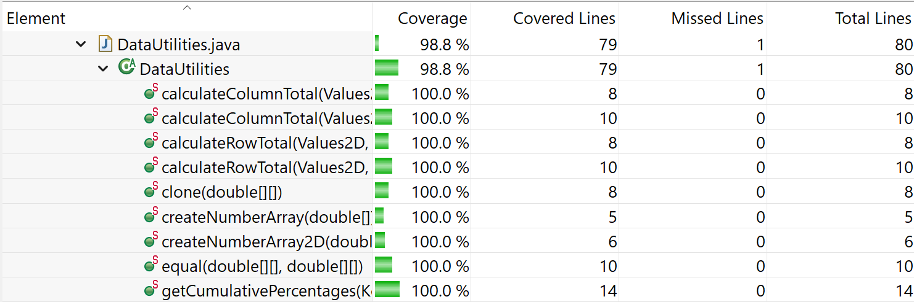
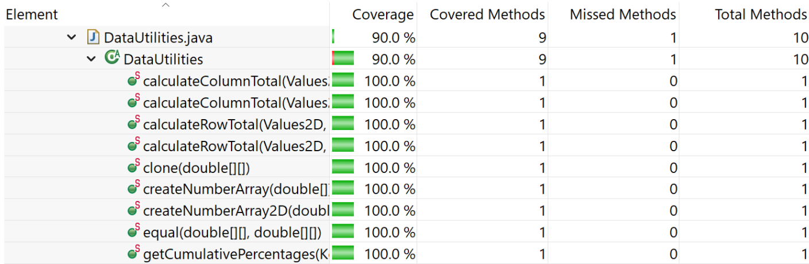
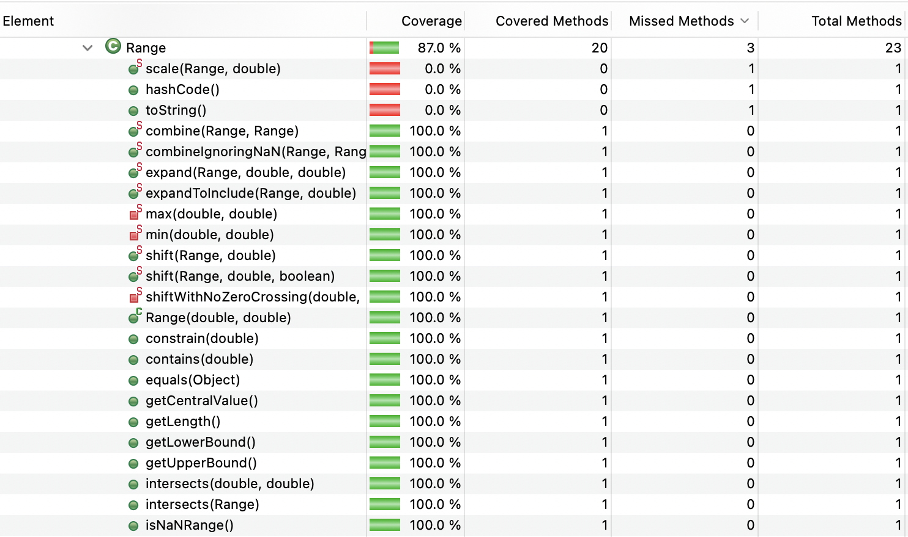

**SENG 438 - Software Testing, Reliability, and Quality**

**Lab. Report #3 – Code Coverage, Adequacy Criteria and Test Case Correlation**

| Group \#:      |  21   |
| -------------- | --- |
| Student Names: | Alexis Hamrak   |
|                | Lauraine Baffot   |
|                | Abhay Khosla |
|                | Rachel Renegado    |

(Note that some labs require individual reports while others require one report
for each group. Please see each lab document for details.)

# 1 Introduction

The main objective of this lab is to introduce the concepts of white box testing using the framework JUnit and using coverage tools that help us create a solid test coverage for our test suite. Also, it verifies our unit tests mostly at the unit testing level. The coverage tools used in the lab also help us in identifying how much of the unit testing has been completed with our tests created and how much is left. White box testing enables you to go through the testing phase of a software development cycle more thoroughly with this strategy you are testing for all possible code paths. 

# 2 Manual data-flow coverage calculations for X and Y methods

Text…

# 3 A detailed description of the testing strategy for the new unit test
### Test plan:
Our test plan is to first identify the existing branch, statement, and condition coverage in our test files. Once this is identified, we will select various methods that we had not tested previously and implement singular test cases to see if we can improve any of our coverage metrics. As we develop tests, we will be continuously checking the coverage. After we have determined how to increase each type of coverage, we will split up the number of test cases we need to write among ourselves and pair-program similar to assignments 1 and 2. In this lab, we will be using EclEmma meaning that we will be using branch, line, and method coverages (replacing statement and condition with branch and method).
 
## Initial Coverage:
 
**Range.java (Alexis, Rachel)**
- Branch = 22.2%
- Line = 39.8%
- Method = 52.2%
 
**DataUtilities.java (Abhay, Lauraine)**
- Branch = 43.8%
- Line = 45.0%
- Method = 50.0%
 
 
## Pair 1: Lauraine and Abhay - DataUtilities 
### Lauraine Tests
` equal(double[][] a, double[][] b) `

Added one test to test when a.lenght != b.length
- Branch: 45.8%
- Line: 46.2%
- Method: 50.0%
 
` calculateColumnTotal(Values2D data, int column) `

Added one test to test what happens if a value in the data is null.
- Branch: 47.9%
- Line: 46.2%
- Method: 50.0%
 
` calculateRowTotal(Values2D data, int row) `

Added one test to test what happens if a value in the data is null.
- Branch: 50.0%
- Line: 46.2%
- Method: 50.0%
 
### Abhay Tests
` getCumulativePercentages(KeyedValues data) `

With the addition of cumulativePercentageForIndexZeroSixteenPercent()
- Branch: 56.2%
- Line: 62.5%
- Method: 60.0%
 
With the addition of cumulativePercentageForIndexZeroSixteenPercentNullIncluded()
- Branch: 60.4%
- Line: 62.5%
- Method: 60.0%
 
 
## Pair 2: Alexis and Rachel - Range
### Alexis Tests
` Range(double lower, double upper)` 

Added one test to test for exception on lower > upper margins
- Branch: 23.6 %
- Line: 42.7%
- Method: 52.2%
 
` intersects(double b0, double b1) `

Added tests for:
1. b0 < than lower margin and intersects, TRUE 
2. b0 and 1 are less than both bounds and dont intersect, FALSE
3. b0 > lower margin, b1 lower than upper margin, intersect, TRUE
4. b0 > lower, b1 > upper, no intersection, FALSE
5. b0 > lower bound, b0 > upper bound, b1 < b0, no intersection, FALSE
- Branch: 40.3%
- Line: 46.6%
- Method: 60.9%
 
` combineIgnoringNaN(Range range1, Range range2)`
 
` min(double d1, double d2) and max(double d1, double d2)`
 
### Rachel Tests
` contains(double value) `

Needed Higher, lower, and middle value to get from little to full coverage 
- Branch: 29.2%
- Line: 43.7%
- Method: 56.5%
 
` constrain(double value) `

Added tests for value within, and outside the range (greater than upper and lower bounds)

` expand(Range range, double lowerMargin, double upperMargin)` 

Added tests using negative lowerMargin and upperMargin to make the lowerBound greater than the upperBound.
*Note: public void expandLowerGreaterThanUpper_Upper() results in a failure*
 
 
## Final Coverage:
**Range.java (Alexis, Rachel)**
- Line = 92.7%
- Branch = 84.7%
- Method = 87.0%
 
**DataUtilities.java (Abhay, Lauraine)**
- Line = 98.8%
- Branch = 91.7%
- Method = 90.0%

# 4 A high level description of five selected test cases you have designed using coverage information, and how they have increased code coverage

Text…

# 5 A detailed report of the coverage achieved of each class and method (a screen shot from the code cover results in green and red color would suffice)

## Data Utilities
### Line

### Branch

### Method

## Range
### Line

### Branch

### Method

# 6 Pros and Cons of coverage tools used and Metrics you report
The primary coverage tool we used in this assignment was ECLEmma as it was preloaded with Eclipse making it an easier procedure to use it instead of downloading other suggested tools in the lecture slides. ECLEmma also provided us with the coverage metrics we were exploring in the lectures as well; for example, method, line, branch coverage was easily distinguishable. Hence ECLEmma created for a test suite coverage an ease with the in-built coverage metrics. ECLEmma did not do one thing which was not able to analyze the condition coverage, which was a downside of this coverage tool, as it could have solidified to be it perfect tool from the understandings in the lecture. The metrics we chose as a group to report were method coverage(if the specific method is being called in the test suite), line coverage(total number of lines of code being covered by the test cases), and branch coverage(checking for the execution paths after decision statements covered by the test cases) this coverage tool was done instead of condition coverage which as mentioned before was not supported by ECLEmma. 

# 7 A comparison on the advantages and disadvantages of requirements-based test generation and coverage-based test generation.

Text…

# 8 A discussion on how the team work/effort was divided and managed
As a group, we decided to use pair testing and divided the two classes between each pair. All of the work was done remotely using Discord with each group member sharing their screens in the pairs that were formed. The methods were also divided to make it easier to complete the lab instead of doing it all in one large group. The work was divided as followed:
 
#### Pair 1: Lauraine and Abhay - DataUtilities
This pair developed a total of 16 additional test cases:
1. cumulativePercentageForIndexZeroSixteen()
2. cumulativePercentageForIndexOneHundred()
3. cumulativePercentageDataNullCheck()
4. cumulativePercentageForIndexZeroSixteenPercentNullIncluded()
5. calculateRowTotalNullChecking()
6. calculateRowTotalWithNull()
7. calculateColumnTotalNullChecking()
8. calculateColumnTotalWithNull()
9. testEqualityOfArrays_DifferentArrayLength()
10. calculateColumnTotalNullData()
11. calculateRowTotalNullData()
12. cloneNullParameter()
13. cloneEmptyArray()
14. cloneNullDataInArray()
15. cloneArrayOfBigAndPositiveValues()
16. cloneArrayOfSmallAndNegativeValues()

#### Pair 1: Alexis and Rachel - Range
This pair developed a total of 23 additional test cases:
1. constructorLowerBoundGreater() 
2. containsValueWithinRange()
3. containsValueOutsideRangeLower()
4. containsValueOutsideRangeHigher() intersectsRangeIsTrue_SecondParamGreater() 
5. intersectsRangeIsFalse_BothParamLess()
6. intersectsRangeIsTrue_BothParamInsideRange()
7. intersectsRangeIsFalse_BothParamGreater()
8. intersectsRangeIsFalse_B0LessThanUpperAndB1LessThanB0() 
9. constrainWithinRange() 
10. constrainOutsideUpperRange()
11. constrainOutsideLowerRange()
12. constrainOutsideLowerRangeEqual()
13. combineIgnoringNaN_Range1Null_Range2NotNull()
14. combineIgnoringNaN_Range1Null_Range2NaN()
15. combineIgnoringNaN_Range1Null_Range2Null() 
16. combineIgnoringNaN_Range1NaN_Range2Null() 
17. combineIgnoringNaN_Range1NotNull_Range2Null() 
18. combineIgnoringNaN_Range1NotNull_Range2NotNull_NoNaN()
19. combineIgnoringNaN_Range1NotNull_Range2NotNull_AllNaN()
20. combineIgnoringNaN_NaNMinRange()
21. minAndMaxD2_NaN() 
22. expandLowerGreaterThanUpper_Lower()
23. expandLowerGreaterThanUpper_Upper()

# 9 Any difficulties encountered, challenges overcome, and lessons learned from performing the lab

Text…

# 10 Comments/feedback on the lab itself

Text…
