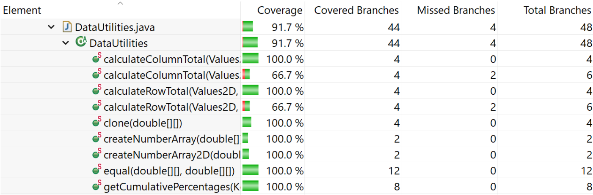

**SENG 438 - Software Testing, Reliability, and Quality**

**Lab. Report #3 – Code Coverage, Adequacy Criteria and Test Case Correlation**

| Group \#:      |  21   |
| -------------- | --- |
| Student Names: | Alexis Hamrak   |
|                | Lauraine Baffot   |
|                | Abhay Khosla |
|                | Rachel Renegado    |

(Note that some labs require individual reports while others require one report
for each group. Please see each lab document for details.)

# 1 Introduction

he main objective of this lab is to introduce the concepts of white box testing using the JUnit framework and using coverage tools that help us create a solid code coverage for our test suite. In addition, implementing white box testing verifies our unit tests at the unit testing level. The coverage tools used in the lab will also help us in identifying how much of the unit testing has been completed with our created tests and how much is left. White box testing enables us to go through the testing phase of a software development cycle more thoroughly and in-depth by testing all possible code paths. 

# 2 Manual data-flow coverage calculations for X and Y methods

Text…

# 3 A detailed description of the testing strategy for the new unit test
### Test plan:
Our test plan is to first identify the existing branch, statement, and condition coverage in our test files. Once this is identified, we will select various methods that we had not tested previously and implement singular test cases to see if we can improve any of our coverage metrics. As we develop tests, we will be continuously checking the coverage. After we have determined how to increase each type of coverage, we will split up the number of test cases we need to write among ourselves and pair-program similar to assignments 1 and 2. In this lab, we will be using EclEmma meaning that we will be using branch, line, and method coverages (replacing statement and condition with branch and method).
 
## Initial Coverage:
 
**Range.java (Alexis, Rachel)**
- Branch = 22.2%
- Line = 39.8%
- Method = 52.2%
 
**DataUtilities.java (Abhay, Lauraine)**
- Branch = 43.8%
- Line = 45.0%
- Method = 50.0%

# 4 A high level description of five selected test cases you have designed using coverage information, and how they have increased code coverage

The five test cases we will be investigating are as follows:
 
## Pair 1: Lauraine and Abhay - DataUtilities
` getCumulativePercentages(KeyedValues data) `
 
With the addition of **cumulativePercentageForIndexZeroSixteen()**
- Branch: 43.8% to 56.2% (increased the branch coverage by 12.4%)
- Line: 45.0% to 62.5% (increased the line coverage by 17.5%)
- Method: 50.0% to  60.0% (increased the method coverage by 10.0%)
 
The test cases which are created were not explored before in assignment two as this method was complicated and required us to have access to the code, hence creating even some test cases increased our code coverage in the metrics used in this assignment. In specific, all of the metrics saw a significant increase due to the factor of not being covered by our test suite which was established in assignment two. Due to the unknown knowledge of what KeyedValues meant in assignment two, this assignment three reinforces our learning on this specific area of the code in the class. The percentage of the coverage which changed is noted down below the analysis on how these specific coverage metrics were affected with this addition of the test case in the test suite. 
 
With the addition of **cloneNullDataInArray()**
- Branch: 43.8% to 52.1% (increased coverage by 8.3%)
- Line: 45.0% to 55.0% (increased coverage by 10.0%)
- Method: 50.0% to 60.0% (increased coverage by 10.0%)
 
Prior to the addition of this case, the method clone(double[][] source) was not being tested by any test cases which resulted in no coverage for that method. Now that this test case has been added, there is an increase in the branch coverage because the test case is coverage of the *for loop* statement and the *if* statement which requires decision branches. The line coverage increased because we are covering the lines where the method can be found (lines 102 - 111). Finally, the method coverage increased as well because an additional method has been covered in the DataUtilitites class.
 
## Pair 2: Alexis and Rachel - Range
`combineIgnoringNaN(Range range1, Range range2)`
 
With the addition of **combineIgnoringNaN_Range1Null_Range2NotNull()**
- Branch: 48.6% to 54.2% (increased coverage by 5.6%)
- Line: 56.3% to 60.2% (increased coverage by 3.9%)
- Method: 69.6% to 78.3% (increased coverage by 8.7%)
 
Prior to the addition of this test case, there were no test cases that tested the functionality for the combineIgnoringNaN(Range range1, Range range2) function. With the addition of this test case, we now enter into the combineIgnoringNaN method, thus reflecting the increase in the method coverage. In addition, the test covers lines 241, 242, and 245 of the Range class, thus covering additional lines of code increasing line coverage. Finally, since the test enters into the two if branch statements, branch coverage also is increased.
 
`scale(Range base, double factor)`
 
With the addition of **scaleNegativeFactor()**
- Branch: 90.3% to 91.7% (increased coverage by 1.4%)
- Line: 86.4% to 89.3% (increased coverage by 2.9%)
- Method: 87.0% to 91.3% (increased coverage by 4.3%) 
 
Prior to the addition of this test case, there were no test cases that tested the functionality for the scale(Range base, double factor) function. With the addition of this test case, we now enter into the scale method, thus reflecting the increase in the method coverage. In addition, the test covers lines 409, 410, and 411 of the Range class, thus covering additional lines of code increasing line coverage. Finally, since the test enters into the if branch statement, branch coverage also is increased.

# 5 A detailed report of the coverage achieved of each class and method (a screen shot from the code cover results in green and red color would suffice)
 
## Final Coverage:
**Range.java (Alexis, Rachel)**
- Line = 91.3%
- Branch = 93.1%
- Method = 91.3%
 
**DataUtilities.java (Abhay, Lauraine)**
- Line = 98.8%
- Branch = 91.7%
- Method = 90.0%

## Data Utilities
### Line

### Branch

### Method

## Range
### Line

### Branch

### Method

# 6 Pros and Cons of coverage tools used and Metrics you report
The primary coverage tool we used in this assignment was ECLEmma as it was preloaded with Eclipse, making it an easier procedure to use instead of downloading other suggested tools in the lecture slides. ECLEmma also provided us with the coverage metrics we were exploring in the lectures as well; for example, method, line, and branch coverage were easily distinguishable and covered the desired categories. Hence, ECLEmma was easy to use with the built-in coverage metrics. ECLEmma was not able to analyze the condition coverage or statement coverage, which was a downside of this coverage tool. As a result, the tool was sufficient for our needs, but it didn’t quite fit with the parameters of our lectures. The metrics we chose as a group to report were method coverage (if the specific method is being called in the test suite), line coverage (total number of lines of code being covered by the test cases), and branch coverage(checking for the execution paths after decision statements being covered by the test cases). Method coverage was used instead of condition coverage, and line coverage was used instead of statement coverage which as mentioned before are not supported by ECLEmma. 

# 7 A comparison on the advantages and disadvantages of requirements-based test generation and coverage-based test generation.
Test generation is defined as creating test suites for identifying errors in the codebase; for this, we have learned two types so far in our lectures. Exploring requirements-based testing, which is using black-box testing as its foundation, means that we need to come up with the test cases without looking at the source code and hence no limitations exist in the test suite. It also ensures that test creation is targeted to check over whether the codebase is actually performing its desired functionality. A disadvantage for this type of testing could result in some missing edge cases as code access is restricted, forcing testers to think outside of the box to verify the test cases. An example could be that if the requirements for the code are unclear, it may lead testing to have important features of the codebase missed. Shifting over to coverage-based testing, it is defined as using the concepts of white-box testing methodologies to create a test suite. A primary advantage of using this form of test generation is that it can help achieve the 100% coverage metrics from the coverage tool that is being used, which ensures the source code is being analyzed completely. The test suite is also enhanced as unit tests are more suited to the codebase instead of unknown source code. Some flaws in creating this type of test are that it requires extensive knowledge about the functionality of the code and its purpose in the whole software program. With many tools out there being open-sourced, it becomes difficult knowing which one is the best for a given test suite. Finally, code coverage does not ensure that the critical sections of the code are being covered by the unit tests created in the suite.

# 8 A discussion on how the team work/effort was divided and managed
As a group, we decided to use pair testing and divided the two classes between each pair. All of the work was done remotely using Discord with each group member sharing their screens in the pairs that were formed. The methods were also divided to make it easier to complete the lab instead of doing it all in one large group. The work was divided as followed:
 
#### Pair 1: Lauraine and Abhay - DataUtilities
This pair developed a total of 16 additional test cases:
1. cumulativePercentageForIndexZeroSixteen()
2. cumulativePercentageForIndexOneHundred()
3. cumulativePercentageDataNullCheck()
4. cumulativePercentageForIndexZeroSixteenPercentNullIncluded()
5. calculateRowTotalNullChecking()
6. calculateRowTotalWithNull()
7. calculateColumnTotalNullChecking()
8. calculateColumnTotalWithNull()
9. testEqualityOfArrays_DifferentArrayLength()
10. calculateColumnTotalNullData()
11. calculateRowTotalNullData()
12. cloneNullParameter()
13. cloneEmptyArray()
14. cloneNullDataInArray()
15. cloneArrayOfBigAndPositiveValues()
16. cloneArrayOfSmallAndNegativeValues()

#### Pair 1: Alexis and Rachel - Range
This pair developed a total of 23 additional test cases:
1. constructorLowerBoundGreater() 
2. containsValueWithinRange()
3. containsValueOutsideRangeLower()
4. containsValueOutsideRangeHigher() intersectsRangeIsTrue_SecondParamGreater() 
5. intersectsRangeIsFalse_BothParamLess()
6. intersectsRangeIsTrue_BothParamInsideRange()
7. intersectsRangeIsFalse_BothParamGreater()
8. intersectsRangeIsFalse_B0LessThanUpperAndB1LessThanB0() 
9. constrainWithinRange() 
10. constrainOutsideUpperRange()
11. constrainOutsideLowerRange()
12. constrainOutsideLowerRangeEqual()
13. combineIgnoringNaN_Range1Null_Range2NotNull()
14. combineIgnoringNaN_Range1Null_Range2NaN()
15. combineIgnoringNaN_Range1Null_Range2Null() 
16. combineIgnoringNaN_Range1NaN_Range2Null() 
17. combineIgnoringNaN_Range1NotNull_Range2Null() 
18. combineIgnoringNaN_Range1NotNull_Range2NotNull_NoNaN()
19. combineIgnoringNaN_Range1NotNull_Range2NotNull_AllNaN()
20. combineIgnoringNaN_NaNMinRange()
21. minAndMaxD2_NaN() 
22. expandLowerGreaterThanUpper_Lower()
23. expandLowerGreaterThanUpper_Upper()

# 9 Any difficulties encountered, challenges overcome, and lessons learned from performing the lab
 
It was somewhat difficult to fully understand how to navigate ECLEmma since we had never operated the software prior. We were unsure how to get the line and method coveraged to show as we initially only saw branch coverage. We resolved this uncertainty when we asked the TA how to navigate the software to change the coverage type. We found there to be some challenges when using the data flow graph to determine def-use sets, DU-pairs and paths. This concept of def-use sets and pairs was new to us, so we had to take some time to review the notes and find some examples online to ensure that we were calculating it correctly. As a result, we had a relatively slow start in the lab. But once we passed this section and moved onto the test development and coverage, it was more efficient. 
 
# 10 Comments/feedback on the lab itself
 
The lab assignment was overall more enjoyable for our group than the previous lab assignment. When we were working on this lab, we felt that we had a more solid understanding of JUnit testing and what kind of tests we would need to write. Using the ECLEmma tool was fairly straightforward and we didn’t need to do much extra research or waste time trying to understand how to use the program even though we initially had some difficulty navigating the coverage types. We found it really easy to understand what our tests covered and switch between the different coverage types. The one issue we had with the lab was that it was not obvious which types of coverage could be used instead of statement, branch, or condition. We spoke with a TA to ensure that we were allowed to make the replacements of line instead of statement, and condition instead of method. 
 
Overall, this lab was worthwhile because it allowed us to understand how to make a proper test suite and ensure that an entire function could be covered by the tests. It allowed us to notice a pattern among the different types of tests we had to write, which in turn helped us write more unit tests in a shorter amount of time.

